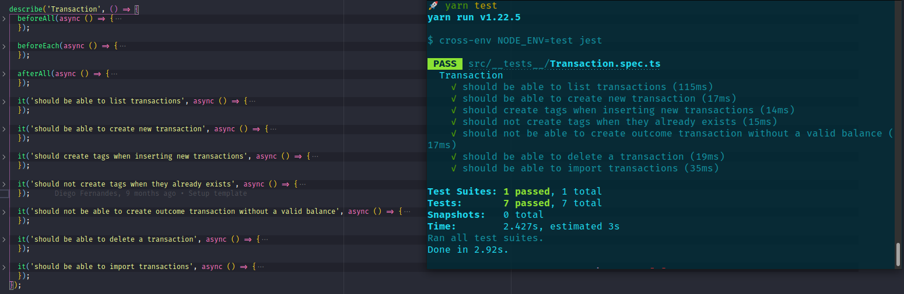

<p align="center">
  
</p>

<h2 align="center">
  Desafio 06: Banco de dados e upload de arquivos no Node.js
</h2>

# Projeto

Aplicação para gestão de transações bancárias. Desenvolvido em Node.js com Typescript. Utilizando banco de dados Postgres com TypeORM. E permitindo o envio de arquivo .csv com o Multer.

## 🧭 Como rodar o projeto?

### Banco de Dados

Deve ter o banco de dados `Postgres` rodando na porta 5432. Utilizando uma imagem do Docker _([tutorial para instalação](https://docs.docker.com/engine))_, rode os seguintes comandos:

```bash
# Criar um container com imagem do postgres
# com nome 'gostack_desafio06', senha 'docker' e servindo na porta 5432
$ docker run --name gostack_desafio06 -e POSTGRES_PASSWORD=docker -p 5432:5432 -d postgres
```

### Rodando o servidor

Após clonar o projeto e já está dentro da pasta e com o banco de dados rodando, utilize os seguintes comandos:

```bash
# Instale as dependências
$ npm install

# Faça a migração das tabelas do banco de dados
$ npm run typeorm migration:run

# Executar o servidor
$ npm run dev:server
```

## Rotas da aplicação

- **`POST /transactions`**: A rota deve receber `title`, `value`, `type`, e `category` dentro do corpo da requisição, sendo o `type` o tipo da transação, que deve ser `income` para entradas (depósitos) e `outcome` para saídas (retiradas). Ao cadastrar uma nova transação, ela deve ser armazenada dentro do seu banco de dados, possuindo os campos `id`, `title`, `value`, `type`, `category_id`, `created_at`, `updated_at`.

* **`GET /transactions`**: Essa rota deve retornar uma listagem com todas as transações que você cadastrou até agora, junto com o valor da soma de entradas, retiradas e total de crédito. Essa rota deve retornar um objeto o seguinte formato:

```json
{
  "transactions": [
    {
      "id": "uuid",
      "title": "Salário",
      "value": 4000,
      "type": "income",
      "category": {
        "id": "uuid",
        "title": "Salary",
        "created_at": "2020-04-20T00:00:49.620Z",
        "updated_at": "2020-04-20T00:00:49.620Z"
      },
      "created_at": "2020-04-20T00:00:49.620Z",
      "updated_at": "2020-04-20T00:00:49.620Z"
    },
    {
      "id": "uuid",
      "title": "Freela",
      "value": 2000,
      "type": "income",
      "category": {
        "id": "uuid",
        "title": "Others",
        "created_at": "2020-04-20T00:00:49.620Z",
        "updated_at": "2020-04-20T00:00:49.620Z"
      },
      "created_at": "2020-04-20T00:00:49.620Z",
      "updated_at": "2020-04-20T00:00:49.620Z"
    },
    {
      "id": "uuid",
      "title": "Pagamento da fatura",
      "value": 4000,
      "type": "outcome",
      "category": {
        "id": "uuid",
        "title": "Others",
        "created_at": "2020-04-20T00:00:49.620Z",
        "updated_at": "2020-04-20T00:00:49.620Z"
      },
      "created_at": "2020-04-20T00:00:49.620Z",
      "updated_at": "2020-04-20T00:00:49.620Z"
    },
    {
      "id": "uuid",
      "title": "Cadeira Gamer",
      "value": 1200,
      "type": "outcome",
      "category": {
        "id": "uuid",
        "title": "Recreation",
        "created_at": "2020-04-20T00:00:49.620Z",
        "updated_at": "2020-04-20T00:00:49.620Z"
      },
      "created_at": "2020-04-20T00:00:49.620Z",
      "updated_at": "2020-04-20T00:00:49.620Z"
    }
  ],
  "balance": {
    "income": 6000,
    "outcome": 5200,
    "total": 800
  }
}
```

- **`DELETE /transactions/:id`**: A rota deve deletar uma transação com o `id` presente nos parâmetros da rota;

* **`POST /transactions/import`**: A rota deve permitir a importação de um arquivo com formato `.csv` contendo as mesmas informações necessárias para criação de uma transação `id`, `title`, `value`, `type`, `category_id`, `created_at`, `updated_at`, onde cada linha do arquivo CSV deve ser um novo registro para o banco de dados, e por fim retorne todas as `transactions` que foram importadas para seu banco de dados. O arquivo csv, deve seguir o seguinte modelo .csv

```csv
title, type, value, category
Loan, income, 1500, Others
Website Hosting, outcome, 50, Others
Ice cream, outcome, 3, Food
```

| title           | type    | value | category |
| --------------- | ------- | ----- | -------- |
| Loan            | income  | 1500  | Others   |
| Website Hosting | outcome | 50    | Others   |
| Ice cream       | outcome | 3     | Food     |

## Teste

Com o banco de dados e a aplicação rodando, para iniciar os testes basta utilizar o seguinte comando: `npm run test`.


